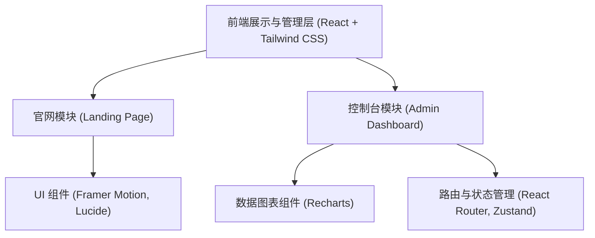
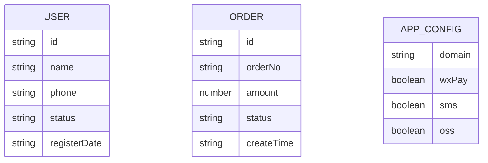

## 1. 架构设计

## 2. 技术说明
- **前端框架**: React 18 + TypeScript + Vite
- **路由控制**: React Router v7，使用嵌套路由实现后台 Layout 结构，并配置登录鉴权守卫（Mock）。
- **样式方案**: Tailwind CSS 3，便于快速构建复杂的后台管理系统 UI。
- **状态管理**: Zustand，用于管理全局侧边栏折叠状态、用户登录信息等。
- **图表库**: Recharts，用于绘制控制台首页的数据统计图表。
- **图标库**: Lucide React

## 3. 路由定义
| 路由 | 目的 |
|-------|---------|
| `/` | 官网首页（Landing Page） |
| `/login` | 管理后台登录页 |
| `/admin` | 后台管理根路由（Layout 包含侧边栏和头部） |
| `/admin/dashboard` | 控制台数据概览 |
| `/admin/users` | 用户管理列表 |
| `/admin/apps` | 应用与模块管理 |
| `/admin/orders` | 订单核销与明细管理 |

## 4. API 定义 (Mock 数据结构)
由于是纯前端复刻展示，我们将使用静态 Mock 数据：
- **Dashboard 数据**: `GET /api/dashboard/stats` 返回核心指标和趋势图数据。
- **用户数据**: `GET /api/users` 返回分页的用户列表数组。
- **订单数据**: `GET /api/orders` 返回最新的订单及核销记录。

## 5. 数据模型 (前端 Mock Store)

