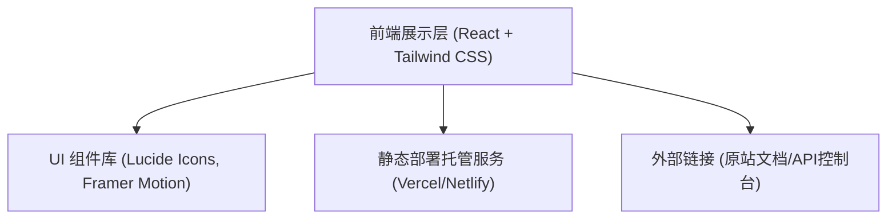

## 1. 架构设计

## 2. 技术说明
- **前端框架**: React 18 + TypeScript + Vite，提供极速的开发体验和优秀的构建性能。
- **样式方案**: Tailwind CSS 3，采用Utility-first的CSS框架，快速实现响应式布局和高度定制化的设计系统。
- **动画与交互**: Framer Motion，用于实现页面滚动进入动画（Scroll Reveal）、卡片悬停交互和流畅的微过渡效果。
- **图标库**: Lucide React，提供一致、简洁的SVG图标集。
- **代码高亮**: react-syntax-highlighter (或 prismjs)，用于在MCP配置区美观地展示JSON代码。
- **构建工具**: Vite

## 3. 路由定义
本复刻项目主要为单页面官网展示（Landing Page）。
| 路由 | 目的 |
|-------|---------|
| `/` | 官网首页，包含产品介绍、MCP配置、文档入口、业务场景、安全保障等所有模块内容。 |

## 4. API 定义
此项目为静态展示官网的复刻，暂无独立的后端接口对接需求。所有CTA链接（如“立即查阅”、“前往电脑端管理后台”）将导向原版“api工厂”的外部链接。

## 5. 数据模型
（此项目为静态展示页面，无复杂数据模型，主要数据结构为页面各区块的配置项对象列表，如卡片列表、场景列表等，将硬编码或作为本地常量数据存储在组件内部。）
