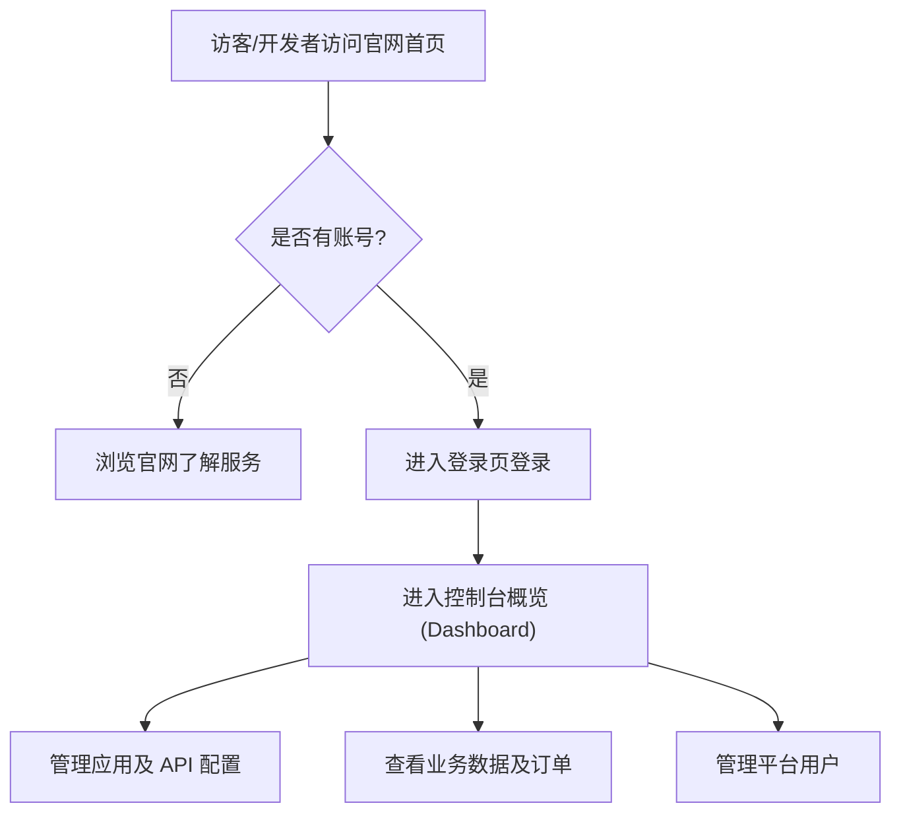

## 1. 产品概述
复刻“api工厂”（it120）的核心系统，包含前台展示官网与后台管理控制台（Admin Dashboard）。
- 官网用于展示 PaaS 中台的特性、API/SDK 文档入口及移动端业务场景。
- 后台控制台用于向开发者和商户提供核心的数据管理、API 调用监控、用户管理及订单核销等服务，实现真正的 BaaS（后端即服务）管理体验。

## 2. 核心功能

### 2.1 用户角色
| 角色 | 注册方式 | 核心权限 |
|------|---------------------|------------------|
| 访客 | 无 | 浏览官网了解服务详情、查阅文档入口 |
| 开发者/商户 | 平台注册 | 登录管理后台，管理应用、查看API统计、管理用户及业务数据 |

### 2.2 功能模块
1. **展示官网**: 包含 Hero、MCP 配置、文档导航、业务场景展示及安全保障模块。
2. **后台工作台 (Dashboard)**: 展示核心业务数据指标（如今日API调用量、新增用户、收入统计等）及数据图表。
3. **API与应用管理**: 管理开发者的专属域名、模块配置及 API 密钥。
4. **用户与业务管理**: 用户列表、订单管理、商品管理及财务明细。
5. **系统设置**: 账号信息、团队成员管理。

### 2.3 页面详情
| 页面名称 | 模块名称 | 功能描述 |
|-----------|-------------|---------------------|
| 首页 | Landing Page | 官网首页展示内容（已完成）。 |
| 登录页 | Login | 开发者账号登录界面。 |
| 控制台首页 | Dashboard | 概览数据面板，提供统计卡片与折线图/柱状图分析。 |
| 用户管理 | User List | 表格展示平台注册用户，支持搜索、分页及状态管理。 |
| 应用管理 | App Config | 查看并复制专属域名、设置各项模块开关（如微信支付、短信服务）。 |
| 订单管理 | Order List | 交易订单明细，支持扫码核销记录查看。 |

## 3. 核心流程

## 4. 用户界面设计

### 4.1 设计风格
- **主色调**：科技蓝（Primary Blue）为主，后台管理系统采用浅灰底色配合白色内容卡片（Admin UI）。
- **后台布局**：经典的左右侧边栏布局（Left Sidebar Navigation + Top Header + Main Content Area）。侧边栏支持折叠，头部包含面包屑和用户头像。
- **字体和字号**：现代无衬线字体，数据表格字体紧凑，关键数据指标加粗大字号显示。
- **组件风格**：大量使用数据卡片（Data Cards）、响应式数据表格（Data Tables）和图表（Charts），统一的圆角和微阴影。

### 4.2 页面设计概览
| 页面名称 | 模块名称 | UI元素 |
|-----------|-------------|-------------|
| 控制台首页 | 数据面板 | 顶部4个核心指标卡片，中间为业务走势图表（折线图），底部为最新动态列表。 |
| 管理列表页 | 数据表格 | 顶部过滤/搜索区，中间斑马线或带分割线的表格，右侧操作列（编辑/删除），底部提供分页器。 |
| 侧边导航 | Sidebar | 深色或纯白主题侧边栏，带选中态的高亮背景和主题色图标。 |

### 4.3 响应式设计
- **后台控制台**：桌面端为主，但在移动端访问时，侧边导航将隐藏为抽屉式菜单（Drawer），表格支持横向滚动。
