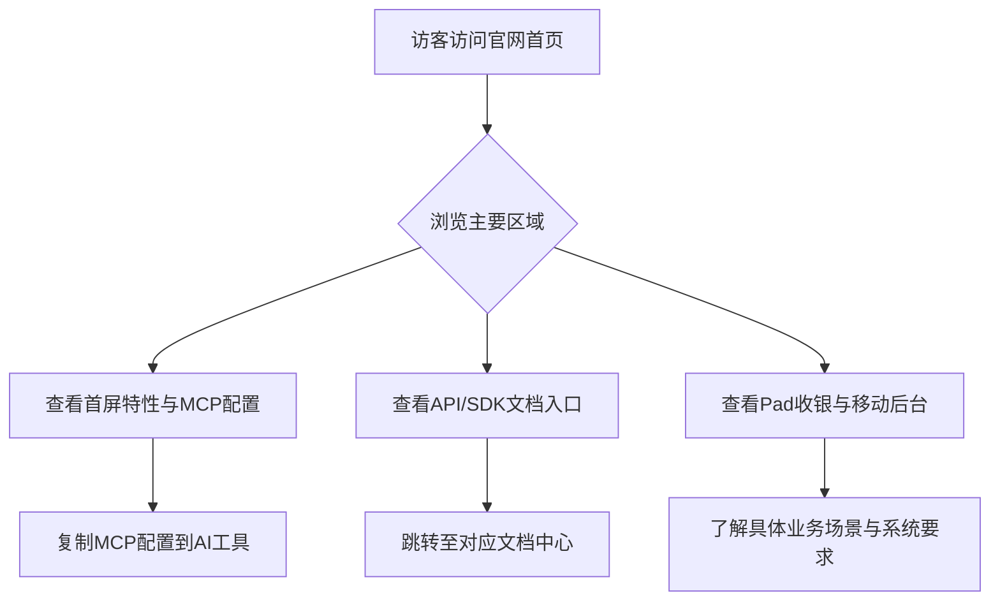

## 1. 产品概述
复刻“api工厂”（https://www.it120.cc/）的前端PaaS中台展示官网。
- 该网站旨在向开发者展示海量API接口、SDK以及免除后端和服务器开发的服务。
- 核心目标是产品宣传、特性展示（API接口、SDK文档、移动端后台、Pad收银系统等），并引导用户添加MCP配置或立即开始使用。

## 2. 核心功能

### 2.1 用户角色
| 角色 | 注册方式 | 核心权限 |
|------|---------------------|------------------|
| 访客 | 无 | 浏览官网了解服务详情、查阅文档入口、复制MCP配置代码 |
| 开发者/商户 | 平台注册 | 登录管理后台，集成API，使用前端及Pad收银系统 |

### 2.2 功能模块
1. **导航栏**: 包含Logo、各类控制台入口及文档链接。
2. **首屏区 (Hero)**: 核心标语“前端PaaS中台”，强调无需后端即可开发应用，提供“立即开始”按钮与开源项目链接。
3. **MCP配置区**: 引导AI开发工具集成MCP，提供可一键复制的代码块。
4. **API/SDK文档导航区**: 前端接口文档、后台接口文档、SDK使用文档的图文卡片入口。
5. **移动端后台与Pad收银系统区**: 介绍移动管理系统，展示iPad/Android Pad在8大收银场景（客户管理、预存消费、付款码收款、核销订单、商品管理、优惠券核销、排队取号、点单点餐、预约报名）的应用。
6. **服务保障与资质区**: 强调服务稳定、数据与资金安全，并展示相关荣誉资质和合作伙伴。
7. **页脚 (Footer)**: 版权信息及其他辅助链接。

### 2.3 页面详情
| 页面名称 | 模块名称 | 功能描述 |
|-----------|-------------|---------------------|
| 首页 | 首屏区 | 左侧展示大标题和特性说明，右侧搭配抽象科技感插画，附带CTA按钮。 |
| 首页 | MCP配置 | 深色代码框展示JSON配置，带有一键复制代码功能，帮助开发者快速集成AI。 |
| 首页 | 文档导航 | 采用图文结合的三列卡片布局，点击跳转对应接口或SDK文档。 |
| 首页 | 业务场景 | 采用图文混排（左图右文或上图下文）介绍移动端后台与Pad收银功能，罗列8个核心业务场景卡片。 |
| 首页 | 安全保障 | 多列布局展示“服务稳定”、“数据安全”、“资金安全”等核心优势，配以相关插图或Icon。 |

## 3. 核心流程
用户浏览官网了解PaaS中台服务，复制MCP配置进行AI开发，或点击“立即开始”跳转至控制台。

## 4. 用户界面设计

### 4.1 设计风格
- **主色调**：科技蓝（Primary Blue）为主，辅以白色背景和浅灰模块背景（Surface Gray），营造专业、可靠的B2B/SaaS科技感。
- **按钮风格**：圆角矩形设计（Rounded），具有平滑的悬停渐变和轻微的阴影过渡（Hover Elevation）。
- **字体和字号**：现代无衬线字体（如 Inter, PingFang SC），标题加粗醒目，正文排版注重层级与留白，清晰易读。
- **布局风格**：主流SaaS官网流式布局，分区块垂直滚动，大卡片结合插图与文字，适当使用留白。
- **图标与插画风格**：扁平化或微渐变风格的SVG科技插画，辅以简洁的线性Icon。

### 4.2 页面设计概览
| 页面名称 | 模块名称 | UI元素 |
|-----------|-------------|-------------|
| 首页 | 首屏区 | 左侧大字号渐变标题与文字描述，右侧搭配科技感Hero插画，显眼的CTA按钮。 |
| 首页 | MCP配置 | 深色（Dark Theme）代码展示框，语法高亮，右上角悬浮复制按钮。 |
| 首页 | 功能卡片 | 响应式网格布局的卡片，白色背景带微阴影，悬停时轻微上浮（Transform: translateY）。 |

### 4.3 响应式设计
采用桌面端优先（Desktop-first）策略，同时完美适配移动端。
- 桌面端：横向展示网格卡片与左右图文排版。
- 移动端：自动折叠为单列流式布局，导航栏在移动端收起为汉堡菜单（Hamburger Menu），适当减小字号与模块间距。
